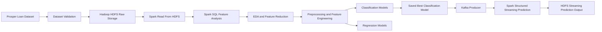

<p align="center">
  <h1 align="center">Prosper Loan Risk Analysis</h1>
  <p align="center">
    Hadoop | HDFS | Spark SQL | Spark MLlib | Kafka | Spark Structured Streaming
  </p>
  <p align="center">
    Big Data course project for loan risk analysis, feature reduction, machine learning, and streaming prediction.
  </p>
</p>

<p align="center">
  
  
  
  
  
  
  
  
  
</p>

---

## Project Overview

This project analyzes loan risk and borrower behavior using the Prosper Loan Dataset with Apache Hadoop, Apache Spark, and Apache Kafka for the streaming demonstration.

Developed as a group academic project for the Big Data course, the project demonstrates a complete big data analytics workflow:

* Distributed storage with Hadoop HDFS
* Spark-based data reading, analysis, and preprocessing
* Spark SQL business insight generation
* Domain-based and EDA-based feature reduction
* Spark MLlib classification and regression modeling
* Kafka and Spark Structured Streaming prediction demonstration

### Project Goals

* Analyze factors affecting loan performance and borrower risk
* Generate business insights using Spark SQL
* Perform feature selection using domain knowledge and data-driven analysis
* Build machine learning models for:

  * Regression: Predict BorrowerAPR
  * Classification: Predict Good Loan / Bad Loan

---

## Dataset

**Dataset:** Prosper Loan Dataset

**Source:**
https://www.kaggle.com/datasets/nurudeenabdulsalaam/prosper-loan-dataset

### Dataset Characteristics

| Metric | Value |
| --- | --- |
| Records | 113,937+ |
| Features | 81 |
| Domain | Financial Services / Credit Risk |
| Time Period | 2005 - 2014 |

The dataset contains borrower demographics, credit history, loan characteristics, risk scores, and loan performance information.

---

## Business Understanding

Peer-to-peer lending platforms must balance loan growth and credit risk.

This project investigates:

* Which borrower characteristics are associated with higher credit risk?
* Which factors influence loan pricing (BorrowerAPR)?
* Can historical borrower information predict loan outcomes?
* How effective are Prosper's internal risk assessment metrics?

---

## Project Architecture



Suggested screenshot groups:

* Hadoop HDFS
* Spark Processing Layer
* Spark SQL Analytics
* Spark MLlib
* Kafka Streaming Layer
* Spark Structured Streaming Prediction
* Business Insights & Prediction Outputs

### Key HDFS Paths

| Data or artifact | HDFS path |
| --- | --- |
| Raw dataset | `hdfs://localhost:9000/bigdata/prosper_loan/raw/prosperLoanData.csv` |
| Domain-reduced dataset | `hdfs://localhost:9000/bigdata/prosper_loan/processed/prosper_loan_reduced` |
| EDA-reduced dataset | `hdfs://localhost:9000/bigdata/prosper_loan/processed/prosper_loan_eda_reduced` |
| Classification dataset | `hdfs://localhost:9000/bigdata/prosper_loan/processed/prosper_loan_preprocessed_classification` |
| Regression dataset | `hdfs://localhost:9000/bigdata/prosper_loan/processed/prosper_loan_preprocessed_regression` |
| Best classification model | `hdfs://localhost:9000/bigdata/prosper_loan/models/classification/best_classification_pipeline_model` |
| Best regression model | `hdfs://localhost:9000/bigdata/prosper_loan/models/regression/best_borrower_apr_model` |
| Streaming prediction output | `hdfs://localhost:9000/bigdata/prosper_loan/streaming/prediction_output` |

---

## Data Pipeline

```text
00_check_dataset.py
        |
01_load_to_hdfs.ps1
        |
02_read_from_hdfs.py
        |
03_feature_analysis.py
        |
04_eda.py
        |
05_ml_preprocessing.py
        |
06_ml_classification.py
        |
07_ml_regression.py
        |
08_spark_structured_streaming_prediction.py
        |
09_kafka_producer.py
```

| Step | Script | Purpose |
| --- | --- | --- |
| 00 | `00_check_dataset.py` | Dataset validation |
| 01 | `01_load_to_hdfs.ps1` | Upload dataset to HDFS |
| 02 | `02_read_from_hdfs.py` | Read dataset from HDFS using Spark |
| 03 | `03_feature_analysis.py` | Domain-based feature analysis, Spark SQL business insights, and reduction from 81 to 23 features |
| 04 | `04_eda.py` | Distribution analysis, correlation analysis, and EDA-based reduction from 23 to 19 features |
| 05 | `05_ml_preprocessing.py` | Missing value handling, duplicate checking, date feature engineering, and target construction |
| 06 | `06_ml_classification.py` | Good Loan / Bad Loan classification modeling |
| 07 | `07_ml_regression.py` | BorrowerAPR regression modeling |
| 08 | `08_spark_structured_streaming_prediction.py` | Spark Structured Streaming prediction with Kafka |
| 09 | `09_kafka_producer.py` | Kafka producer for streaming simulation |

---

## Key Features

| Area | Implementation |
| --- | --- |
| Hadoop HDFS Storage | Raw, processed, model, and streaming outputs are stored in HDFS paths under `/bigdata/prosper_loan`. |
| Spark SQL Analytics | Spark SQL is used for business insight generation and domain-based feature analysis. |
| EDA | Distribution analysis, missing value analysis, and correlation analysis are performed before modeling. |
| Feature Engineering | Date features are derived from listing, origination, credit pull, and first credit line dates. |
| Classification | Good Loan / Bad Loan prediction using Spark MLlib classifiers. |
| Regression | BorrowerAPR prediction using Spark MLlib regressors. |
| Kafka Streaming | Kafka producer and Spark Structured Streaming demonstrate real-time loan risk prediction. |

---

## Methodology

### Phase 1: Data Understanding

* Dataset exploration
* Schema analysis
* Feature categorization
* Missing value inspection

### Phase 2: Feature Selection

* Domain-driven feature grouping
* Spark SQL analysis
* Correlation analysis
* Redundancy reduction
* Data leakage detection

### Phase 3: Business Insight Analysis

Spark SQL was used to identify:

* High-risk borrower segments
* Credit score behavior
* Income and loan performance relationships
* Default risk patterns
* Geographic and demographic trends

### Phase 4: Machine Learning

| Task | Target | Objective | Models |
| --- | --- | --- | --- |
| Regression | BorrowerAPR | Predict annual borrowing cost using borrower credit information | Linear Regression, Random Forest Regressor, Gradient Boosted Trees Regressor |
| Classification | Good Loan / Bad Loan | Predict loan quality using borrower risk indicators | Logistic Regression, Random Forest Classifier, Gradient Boosted Trees Classifier |

### Phase 5: Streaming Demonstration

Kafka and Spark Structured Streaming are used to simulate incoming loan records, load the best saved classification model, predict Good Loan / Bad Loan, and write streaming prediction outputs to HDFS.

---

## Preprocessing

File `05_ml_preprocessing.py` reads the EDA-reduced dataset from:

```text
hdfs://localhost:9000/bigdata/prosper_loan/processed/prosper_loan_eda_reduced
```

The preprocessing step checks duplicates, removes configured high-missing-value features if still present, summarizes missing values, creates date-based features, standardizes data types, fills numeric values with medians, fills categorical values with `Unknown`, and creates task-specific outputs.

### Feature Reduction Summary

| Stage | Feature count |
| --- | ---: |
| Raw dataset | 81 |
| After domain-based reduction | 23 |
| After EDA | 19 |

### High-Missing-Value Features Removed

These features are removed because missing value percentage exceeds 80%.

| Removed feature |
| --- |
| TotalProsperLoans |
| ProsperPaymentsLessThanOneMonthLate |
| ProsperPaymentsOneMonthPlusLate |

### Date Feature Engineering

| Original date columns | Generated features |
| --- | --- |
| ListingCreationDate | listing_year, listing_month |
| LoanOriginationDate | loan_origination_year, loan_origination_month |
| FirstRecordedCreditLine | credit_history_days |
| DateCreditPulled | credit_pull_to_origination_days |

### Preprocessed Outputs

| Task | HDFS output |
| --- | --- |
| Classification | `hdfs://localhost:9000/bigdata/prosper_loan/processed/prosper_loan_preprocessed_classification` |
| Regression | `hdfs://localhost:9000/bigdata/prosper_loan/processed/prosper_loan_preprocessed_regression` |

---

## Spark SQL Business Insights

Examples of business questions explored:

* Which borrower groups have the highest default risk?
* Does ProsperScore effectively measure borrower risk?
* How does Debt-to-Income Ratio impact loan outcomes?
* Do homeowners have lower loan risk?
* How does previous repayment behavior affect future loans?

[TODO: Insert SQL result screenshots]

Suggested screenshots:

* ProsperScore vs Bad Loan Rate
* Credit Score vs Default Risk
* Income Range Analysis
* Debt-to-Income Ratio Analysis
* Loan Amount Analysis

---

## Machine Learning Results

### Classification

| Item | Detail |
| --- | --- |
| Objective | Predict Good Loan / Bad Loan |
| Label 0 | Completed = Good Loan |
| Label 1 | Chargedoff, Defaulted = Bad Loan |
| Excluded statuses | Current and other unfinished statuses |
| Models | Logistic Regression, Random Forest Classifier, Gradient Boosted Trees Classifier |
| Metrics |  |


### Regression

| Item | Detail |
| --- | --- |
| Objective | Predict BorrowerAPR |
| Target | BorrowerAPR |
| Models | Linear Regression, Random Forest Regressor, Gradient Boosted Trees Regressor |
| Metrics |  |

### Model Comparison

| Task | Models evaluated | Result summary |
| --- | --- | --- |
| Classification | Logistic Regression, Random Forest Classifier, Gradient Boosted Trees Classifier | GBTClassifier - Accuracy: 0.6755 - F1 Score: 0.6876 - ROC-AUC: 0.7496 - PR-AUC: 0.5591 |
| Regression | Linear Regression, Random Forest Regressor, Gradient Boosted Trees Regressor | GBTRegressor - RMSE: 0.0258 - MAE: 0.0146 - R²: 0.8970 - MAPE: 0.0797 |

### Important Findings

| Area | Verified summary |
| --- | --- |
| Feature reduction | Features are reduced from 81 raw features to 23 domain-selected features and then to 19 EDA-reduced features. |
| Missing value handling | TotalProsperLoans, ProsperPaymentsLessThanOneMonthLate, and ProsperPaymentsOneMonthPlusLate are removed because missing value percentage exceeds 80%. |
| Classification target | Only finalized statuses are used: Completed as Good Loan, Chargedoff and Defaulted as Bad Loan. |
| Regression target | BorrowerAPR is used as the regression target. |
| Final metrics | [TODO: Insert verified model metrics after running or exporting final results] |

---

## Screenshots

No screenshot files are currently present in the repository. Suggested organization:

| Group | Suggested content |
| --- | --- |
| Hadoop/HDFS | HDFS directory listing, uploaded raw dataset |
| Spark SQL | Business insight query outputs |
| EDA | Distribution charts, correlation matrix, removed-feature table |
| Machine Learning | Model comparison charts, confusion matrix, feature importance |
| Streaming | Kafka producer logs, Spark Structured Streaming prediction output |

---

## Technologies

| Category | Tools |
| --- | --- |
| Distributed Storage | Apache Hadoop, HDFS |
| Data Processing | Apache Spark, Spark SQL |
| Machine Learning | Spark MLlib |
| Streaming | Apache Kafka, Spark Structured Streaming |
| Programming | Python, PowerShell |
| Analysis and Visualization | Jupyter Notebook, Pandas, Matplotlib, Seaborn |
| Development | VS Code |

---

## Repository Structure

```text
big-data-prosper-loan-risk-analysis/
|
|-- data/
|   `-- processed/
|
|-- environment/
|   |-- config_files/
|   |-- hadoop_installation_steps.md
|   |-- hdfs_commands.md
|   |-- kafka_installation_steps.md
|   `-- spark_installation_steps.md
|
|-- src/
|   |-- 00_check_dataset.py
|   |-- 01_load_to_hdfs.ps1
|   |-- 02_read_from_hdfs.py
|   |-- 03_feature_analysis.py
|   |-- 04_eda.py
|   |-- 05_ml_preprocessing.py
|   |-- 06_ml_classification.py
|   |-- 07_ml_regression.py
|   |-- 08_spark_structured_streaming_prediction.py
|   `-- 09_kafka_producer.py
|
|-- main.ipynb
`-- README.md
```

---

## Setup & Usage

### Prerequisites

- Python 3.x
- Apache Hadoop
- Apache Spark
- Java JDK
- Apache Kafka
- kafka-python

### Clone Repository

```bash
git clone https://github.com/myky14/big-data-prosper-loan-risk-analysis

cd big-data-prosper-loan-risk-analysis
```

### Start Hadoop

```bash
start-dfs.cmd
start-yarn.cmd
```

### Verify HDFS

```bash
hdfs dfs -ls /
```

### Run Spark Scripts

```bash
spark-submit src/00_check_dataset.py
powershell -ExecutionPolicy Bypass -File src/01_load_to_hdfs.ps1
spark-submit src/02_read_from_hdfs.py
spark-submit src/03_feature_analysis.py
spark-submit src/04_eda.py
spark-submit src/05_ml_preprocessing.py
spark-submit src/06_ml_classification.py
spark-submit src/07_ml_regression.py
```

For the Kafka + Spark Structured Streaming demonstration, run the Source 08 streaming prediction code after the classification model and streaming sample have been generated, then run the producer in a separate terminal:

```bash
python src/09_kafka_producer.py
```

---

## Status

| Status | Detail |
| --- | --- |
| Project Status | Pipeline implemented |
| Current scope | Dataset validation, HDFS loading, Spark-based reading, domain feature analysis, EDA-based feature reduction, preprocessing, classification, regression, and Kafka + Spark Structured Streaming prediction demonstration |

---

## Team Members

* Nguyen Du My Ky
* Tran Hong Mai
* Duong Thanh Ngoc

---

## References

* Prosper Loan Dataset (Kaggle)
* Apache Hadoop Documentation
* Apache Spark Documentation
* Spark MLlib Documentation
* Apache Kafka Documentation

---

<p align="center">
  Built for the Big Data and Applications course.<br>
  University of Economics Ho Chi Minh City (UEH)
</p>
